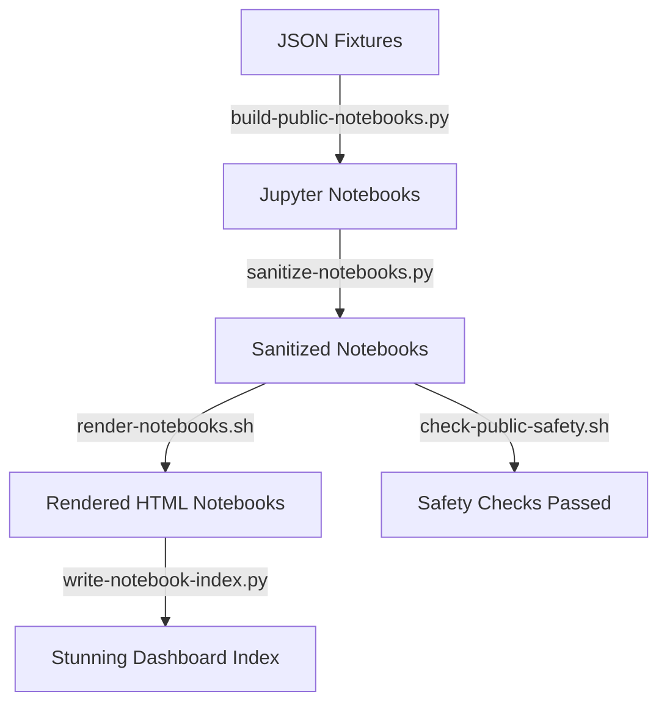
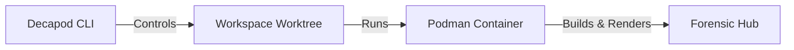
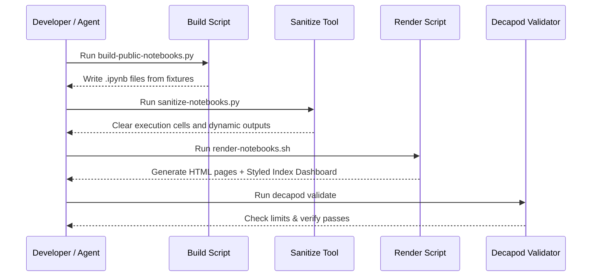

# Architecture

## Direction
Defensive incident writing and static compilation pipelines.

## What This Project Is
A static research hub designed to compile incident summaries, threat surfaces, detection criteria, and HTML rendered forensic workbooks safely from static JSON fixtures.

Architectural principles:
- **Zero-Execution Sandbox**: No pipeline step runs or executes the malware sample. Analysis is entirely static, driven by JSON data fixtures.
- **Output Sanitization**: The notebook pipeline strictly filters and sanitizes notebook code cells to prevent dynamic state leakage.
- **Decapod Scoping**: Workspace changes are isolated to branch-level worktrees and validated against the Decapod control plane before promotion.

## Current Facts
- Runtime/languages: Python, Bash, HTML/CSS
- Primary framework: nbconvert, nbformat, Jinja2 template engine
- Product type: Static documentation and HTML forensic portal

## Architecture Map
The project's structure consists of the following key directories and files:
- `notebooks/`: Source Jupyter notebooks compiled from static metadata.
- `docs/notebooks/`: Clean, rendered HTML outputs, including the styled index dashboard.
- `fixtures/`: JSON data fixtures representing the inspected PE binary features and claims classifications.
- `scripts/`: Python and Bash scripts implementing the build, sanitize, render, and safety check pipeline.
- `fixtures/static-pe-features.public.json`: Inert static signatures of the PE binary.
- `fixtures/claims-classification.public.json`: Verified, likely, possible, and unproven claims boundaries.

## Data Flows

## Strongest Existing Primitives
- **`sanitize-notebooks.py`**: Ensures all code cells in the notebooks are cleared of dynamic execution output.
- **`check-public-safety.sh`**: Scans the source and rendered workbooks for traversal paths, hidden payloads, and dynamic commands.
- **`check_archive_paths.py`**: Inspects ZIP directory metadata to identify nested archives, absolute paths, or executable suffixes without extraction.

## Topology

## Store Boundaries
The repository contains two distinct storage classes:
- **Workspace Source Directory**: Read-write zone for notebooks, scripts, and Markdown reports.
- **Decapod Control State (`.decapod/`)**: Metadata stores, todo databases, and validation policy ledgers managed exclusively via the Decapod CLI.

## Happy Path Sequence

## ADR Register
| ADR | Title | Status | Rationale | Date |
|---|---|---|---|---|
| ADR-001 | JSON-Driven Notebook Generation | Approved | Generate notebooks from inert JSON to avoid executing untrusted commands on the build machine. | 2026-07-08 |
| ADR-002 | Containerized Renders | Approved | Run the nbconvert compilation inside a network-isolated Podman container to protect the host. | 2026-07-08 |
| ADR-003 | Glassmorphic Hub Interface | Approved | Implement a high-aesthetic CSS dark-mode dashboard for the notebook landing page to improve developer UX. | 2026-07-08 |

## Risks and Mitigations
| Risk | Likelihood | Impact | Mitigation |
|---|---|---|---|
| Accidental execution of sample | Low | Critical | Strict quarantine policy; binary is never run, only static metadata is analyzed. |
| Clean working tree violation | Medium | Low | Maintain strict commit frequency to satisfy Decapod's 6-dirty-file validator limit. |\n