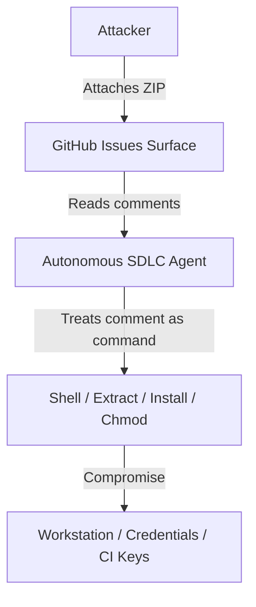

# Security

## Threat Model
The core threat is **Collaboration-Plane Injection**: smuggling hostile payloads into autonomous development workflows. The boundary of interest is the interface where natural-language comments and issue attachments cross into code execution or filesystem mutation.

## STRIDE Table
| Threat | Surface | Mitigation | Verification |
|---|---|---|---|
| **Spoofing** | Contributor identity | Treat all external profile data and names as untrusted. | Author profile age + sign checks |
| **Tampering** | Working tree files | Sandbox execution; prevent agents from auto-writing from comments. | Strict intake rules + `git diff` review |
| **Repudiation** | Intake changes | Require signed, cryptographic Git commits for all verified updates. | `commit.gpgsign = true` |
| **Information disclosure** | Telemetry and logs | Omit live secrets, access tokens, and environment paths from public files. | Safety scan (`check-public-safety.sh`) |
| **Denial of service** | Archive intake | Validate file size ratios and path depth in archives before listing. | `check_archive_paths.py` |
| **Elevation of privilege** | Tool execution | Run tools in isolated, password-gated, non-root workspaces. | Podman/Docker non-root execution |

## Authentication & Authorization
- **Human Gatekeeper**: Any operation that extracts files to the worktree, installs dependencies, runs tests, or runs terminal commands requires explicit human approval.
- **Agent Authority**: The agent operates with read-only permissions for external sources and restricted write access in todo-scoped worktrees.

## Data Classification
| Data Class | Description | Storage Rules | Access Rules |
|---|---|---|---|
| **Public** | Hashed features, indicators, timeline, and sanitized notebooks | Committed to repository | Unrestricted |
| **Private** | Attacker-provided ZIP files (`core_fix_v2.zip`) | Kept in isolated local quarantine outside worktree | Analyst only |
| **Restricted** | Attacker-provided executables (`core_fix_v2.exe`) | Encrypted and stored offline | Forbidden from repository |

## Supply Chain Security
- **Pipeline Integrity**: Rebuilding the public notebooks runs inside network-isolated containers to prevent DNS or package hijacking during build.
- **Scanners**: Checked via `check-public-safety.sh` to prevent inclusion of malicious JavaScript, iframe, or raw payload references in static files.\n