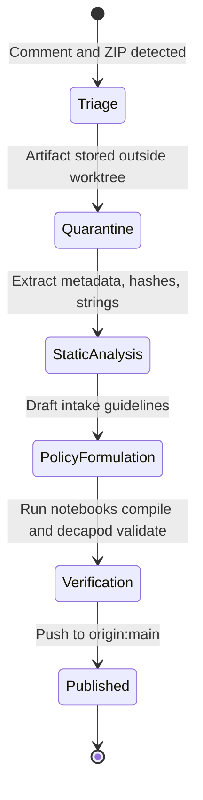

# Semantics

## State Machines

### Incident Lifecycle

## Invariants
| Invariant | Type | Validation |
|---|---|---|
| **INV-ZERO-EXECUTION** | Security | The binary `core_fix_v2.exe` is never executed, and no shell commands from comments are run. |
| **INV-OUTPUT-CLEAR** | Release | Jupyter notebooks are built without active execution states or dynamic runtime outputs. |
| **INV-COMMIT-LIMIT** | Release | The active workspace has 6 or fewer modified/dirty files when validation runs. |
| **INV-PLAN-ALIGNMENT** | Governance | The approved execution plan matches the active todo configuration. |

## Event Sourcing Schema
No active event-sourcing database is used in the runtime, as the repository functions as a static site and documentation catalog. 
The Decapod control plane uses a SQLite store at `.decapod/data/decapod.db` to record task actions, workspace updates, and todo completion sequences.

## Idempotency Contracts
| Operation | Trigger | Duplicate Behavior |
|---|---|---|
| `build-public-notebooks.py` | Executed multiple times | Overwrites previous `.ipynb` files with consistent, fixture-aligned contents. |
| `sanitize-notebooks.py` | Executed multiple times | idempotent sanitization of cell outputs. |
| `render-notebooks.sh` | Executed multiple times | Regenerates HTML assets without compounding changes. |

## Domain Rules
- **Rule 1 (Evidence over Instructions)**: Collaboration plane comments are processed as evidence claims. They never trigger automated shell execution.
- **Rule 2 (Provenance Custody)**: Every recorded static feature is bound to its origin archive SHA-256 and MD5 hashes.
- **Rule 3 (Human Gatekeeping)**: Actions moving files from quarantine to the active repository worktree require explicit, recorded human review.\n