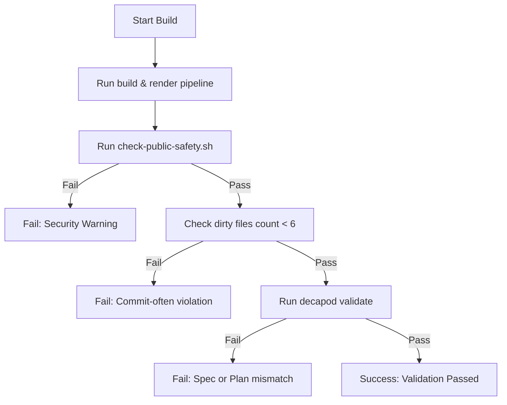

# Validation

## Validation Philosophy
> Validation is a release gate, not documentation theater. In this repository, validation ensures that no dynamic malware execution occurs during compilation, no secrets are leaked, and the working tree is kept clean.

## Validation Harness
The validation harness is implemented through local testing utilities and the Decapod governance validator:
- **`scripts/check-public-safety.sh`**: Scans rendered HTML files for unexpected commands, inline script tags, raw paths, or traversal strings.
- **`scripts/sanitize-notebooks.py`**: Ensures all code cells in the notebooks are cleared of dynamic execution output.
- **`decapod validate`**: Runs control-plane gates locally and within the container workspace to check policy conformance, commit cleanliness, and spec alignment.

## Generated Spec Refresh Gates
To sync generated specs and prevent drift, run:
```bash
decapod rpc --op specs.refresh
```
This updates the specs manifest (`.decapod/generated/specs/.manifest.json`) with the latest cryptographic hashes of the markdown files under `.decapod/generated/specs/`.

## Validation Decision Tree


## Proof Surfaces
- **`decapod validate`**: Main entrypoint for checking all invariants (including dirty files count, session token freshness, and manifest validation).
- **`decapod qa verify todo <task-id>`**: Verifies the task baseline output matches the generated verification manifest.

## Blocking Gates
| Gate | Command / Target | Evidence / Output |
|---|---|---|
| Archive Path Safety | `python3 scripts/check_archive_paths.py` | Command exit code `1` (if anomalies are found) |
| Public Safety Scans | `bash scripts/check_public-safety.sh` | Verified clean notebooks without script tags or raw files |
| Commit Cleanliness | `git status` check during validation | Blocks if more than 6 dirty files are in the worktree |
| Plan Approval | Checked during `decapod validate` | Mismatch between local plan and root plan triggers block |

## Evidence Artifacts
- **`.decapod/governance/plan.json`**: The approved plan tracking completion states of all tasks.
- **`docs/notebooks/`**: Static rendered HTML pages reflecting the forensic appendix.
- **`.decapod/generated/specs/.manifest.json`**: Cryptographic fingerprints of the specification files.

## Bounded Execution
| Operation | Timeout | Failure Mode |
|---|---|---|
| `decapod validate` | 30s | Process termination / non-zero exit |
| Containerized build | 120s | Network activity detected / package install fail |\n